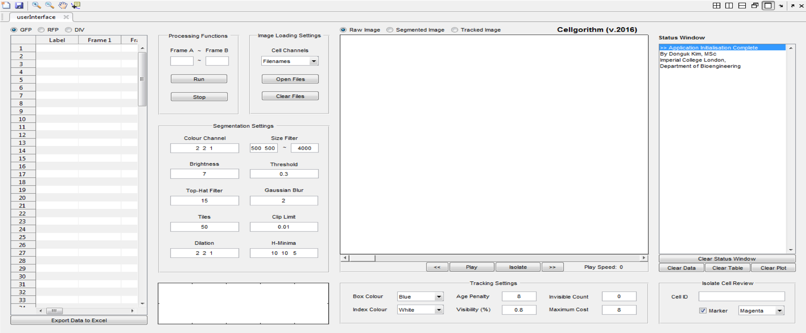

# Cell Tracker

## Background and Overview
Cell tracker was developed to track cellular motion and cytometric data in fluorescent microscopy images over time.
The application was developed using MATLAB and the image processing toolbox.

