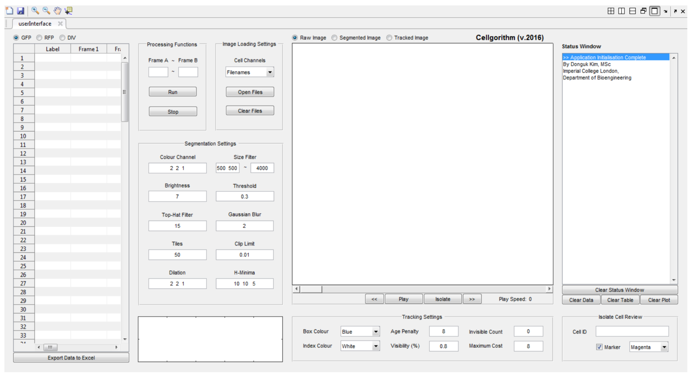

# Cell Tracker

## Background and Overview
Cell tracker was developed in MATLAB to track cellular motion and cytometric data in fluorescent microscopy images over time.
The image processing toolbox was used to investigate and apply mathematical algorithms to ensure reliable cellular trajectory tracking.
The builtin MATLAB UI creator was used to produce an intuitive user interface in order to perform accuracy testing of the source code.

